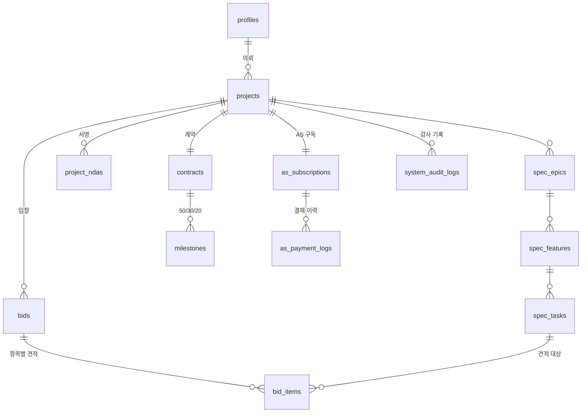

# 데이터베이스

아칸의 스키마·비즈니스 규칙·접근 통제 정의. Supabase(PostgreSQL) 기준이며
계정 없이 로컬 PostgreSQL 14+ 만으로도 전부 검증할 수 있다.

```bash
./scripts/db-test.sh     # 스키마 적용 → 규칙 19건 + RLS 19건 검증 → 시드 확인
```

## 구성

| 파일 | 내용 |
| --- | --- |
| `supabase/migrations/…_init_schema.sql` | 13개 테이블, 9개 열거형, 인덱스, CHECK 제약 |
| `supabase/migrations/…_business_rules.sql` | 규칙을 강제하는 함수·트리거 |
| `supabase/migrations/…_rls_policies.sql` | Row Level Security 정책과 판정 함수 |
| `supabase/seed.sql` | 데모 데이터(진행 중 1건 + 입찰 중 1건) |
| `supabase/tests/00_local_shim.sql` | 로컬 검증용 `auth` 스키마 셰임 (배포 대상 아님) |
| `supabase/tests/01_rules_test.sql` | 비즈니스 규칙 19건 |
| `supabase/tests/02_rls_test.sql` | 역할별 RLS 19건 |

## 스키마



금액은 원 단위 정수(`bigint`), 공수는 `numeric(6,2)`를 쓴다. 견적 항목 금액
(`bid_items.amount`)은 저장하지 않고 `man_day × unit_price` 로 생성한다.

## DB가 강제하는 규칙

애플리케이션 코드가 바뀌어도 아래는 깨지지 않는다. 모두 검증 스위트로 확인된다.

| # | 규칙 | 구현 |
| --- | --- | --- |
| 1 | 감사 로그는 추가만 가능 | UPDATE/DELETE/TRUNCATE 트리거 차단 + 권한 회수 |
| 2 | 계약 체결 시 50/30/20 마일스톤 자동 생성 | `archon_create_milestones` 트리거 |
| 3 | 마일스톤 합계 = 계약 총액 | 지연 제약 트리거 (1·2단계 버림, 3단계 잔액 보정) |
| 4 | 단계별 비율은 0.5/0.3/0.2 고정 | CHECK 제약 |
| 5 | 마일스톤 상태는 정해진 순서로만 전이 | `archon_check_milestone_transition` |
| 6 | 정산 완료된 마일스톤은 되돌릴 수 없음 | 같은 트리거 |
| 7 | 검수 반려에는 10자 이상 사유 필요 | 같은 트리거 |
| 8 | 분쟁 전환에는 10자 이상 사유 필요 | CHECK 제약 |
| 9 | NDA 서명 없이는 입찰 불가 | `archon_check_nda_before_bid` |
| 10 | 제출 시 모든 태스크가 견적돼야 함 | `archon_assert_bid_complete` |
| 11 | 입찰 총액·총공수는 항목에서 자동 산출 | `archon_recalc_bid_totals` |
| 12 | 다른 프로젝트 태스크에는 견적 불가 | `archon_check_bid_item_scope` |
| 13 | 프로젝트당 선정 입찰은 1건 | 부분 유니크 인덱스 |
| 14 | 선정 시 나머지 입찰 자동 탈락 | `archon_on_bid_accepted` |
| 15 | 카드번호로 보이는 값은 빌링키에 저장 불가 | CHECK 제약 |

### 입찰의 draft → submitted

클라이언트가 REST로 붙는 구조라 입찰 행과 견적 항목이 서로 다른 트랜잭션으로
들어온다. 그래서 입찰은 `draft` 로 만들어 항목을 채운 뒤 `submitted` 로
전이시키고, 완결성 검사는 그 전이 시점에 한다. `draft` 입찰은 본인과 운영사
외에는 보이지 않는다.

## 접근 통제 (RLS)

클라이언트가 anon 키로 DB에 직접 접근하므로 **실제 보안은 전적으로 RLS**다.
화면단의 `canViewSpecDetail()` 은 사용자 편의일 뿐 차단 수단이 아니다.

| 대상 | 볼 수 있는 것 |
| --- | --- |
| 비로그인(anon) | 없음 — 테이블 접근 자체가 거부됨 |
| 제3자 | 입찰 중인 프로젝트의 제목·요약까지. 상세 스펙은 차단 |
| NDA 서명 파트너 | 상세 스펙 전체, **자기 입찰만** (경쟁사 견적 차단) |
| 계약 수행사 | 위 + 칸반 상태 변경, 검수 요청 |
| 의뢰자 | 자기 프로젝트 전체, 모든 입찰 비교, 예치·검수 승인/반려 |
| 운영 관리자 | 전체 조회 + 강제 정산·환불 |

NDA 게이트의 실제 구현은 `archon_can_view_spec()` 이며 `spec_epics` /
`spec_features` / `spec_tasks` 의 SELECT 정책이 이 함수를 참조한다.

## 앱 연결

정적 배포(GitHub Pages)에서도 Supabase는 그대로 쓸 수 있다. 브라우저가 anon
키로 직접 붙고 RLS가 통제하는 구조라 서버가 필요 없다.

### 1. 프로젝트 만들기

[supabase.com/dashboard](https://supabase.com/dashboard) → **New project**
→ 이름 `archon`, 리전 `Northeast Asia (Seoul)` 권장 → 생성까지 1~2분.

### 2. 스키마 적용

좌측 **SQL Editor** → **New query** →
[`supabase/schema.sql`](../supabase/schema.sql) 전체를 붙여넣고 **Run**.
(마이그레이션 3개를 순서대로 합쳐둔 파일이다. `supabase` CLI를 쓴다면
`supabase db push` 로 대체할 수 있다.)

적용 결과 확인:

```sql
select count(*) from pg_tables   where schemaname = 'public';  -- 13
select count(*) from pg_policies where schemaname = 'public';  -- 32
```

데모 데이터가 필요하면 이어서 [`supabase/seed.sql`](../supabase/seed.sql) 실행.
(시드는 `auth.users` 를 직접 INSERT 하므로 실제 로그인 계정과는 별개다.)

### 3. 키 확인 및 점검

**Project Settings → API** 에서 `Project URL` 과 `anon public` 키를 복사한 뒤:

```bash
NEXT_PUBLIC_SUPABASE_URL=https://<ref>.supabase.co \
NEXT_PUBLIC_SUPABASE_ANON_KEY=<anon public 키> \
npm run supabase:check
```

13개 테이블이 **존재 + 비로그인 차단됨** 으로 나오면 정상이다. 테이블이
비로그인 상태에서 조회되면 RLS가 적용되지 않은 것이니 2단계를 다시 확인한다.
스크립트는 service_role 키가 들어오면 즉시 중단하고 폐기를 안내한다.

### 4. 배포에 주입

저장소 **Settings → Secrets and variables → Actions → New repository secret**

| 시크릿 | 값 |
| --- | --- |
| `NEXT_PUBLIC_SUPABASE_URL` | `https://<project-ref>.supabase.co` |
| `NEXT_PUBLIC_SUPABASE_ANON_KEY` | anon public 키 |

`.github/workflows/deploy-pages.yml` 이 이미 두 값을 빌드에 주입한다.
시크릿이 비어 있으면 앱은 클라이언트 도메인 스토어(데모 모드)로 동작한다.

### 키 취급

anon 키는 브라우저 번들에 포함되는 **공개 값**이다(보안은 RLS가 담당).
**service_role 키는 저장소·번들·환경 변수 어디에도 넣지 않는다** — 모든 RLS를
우회하므로 유출 시 전체 데이터가 노출된다.

## 남은 작업

- `src/lib/domain/store.ts` 의 클라이언트 스토어를 Supabase 레포지토리로 교체
- `auth.users` 생성은 Supabase Auth 가입 흐름으로 연결 (시드의 직접 INSERT는 로컬 전용)
- `as_payment_logs` 쓰기는 PG 웹훅(service_role)이 담당 — 클라이언트 쓰기 정책 없음
